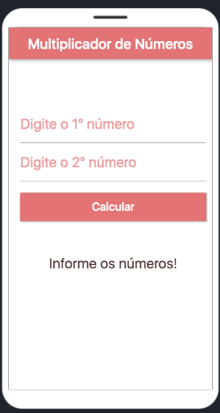
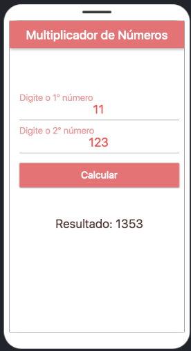

<h1 align="center">
   ✖️ <a href="#"> APP DE MULTIPLICAÇÃO </a> ✖️
</h1>

<h3 align="center">
    Aplicativo de multiplicação feito com Flutter.  
</h3>

     

<h4 align="center"> 
	 Status: Concluído
</h4>

 <a href="#sobre">Sobre</a> •
 <a href="#funcionalidades">Funcionalidades</a> •
 <a href="#layout">Layout</a> • 
 <a href="#recursos">Recursos</a> • 
 <a href="#autora">Autora</a>

## Sobre

Aplicativo de multiplicação feito com Flutter para um projeto de um curso.

---

## Funcionalidades

- [x] Obtenção do resultado a partir de dois valores

---

## Layout

  

  

---

## Recursos

Esse projeto foi feito com a IDE Online FlutLab
- https://flutlab.io

Começando com o Flutter
- https://flutter.dev/docs/

---

## Como contribuir para o projeto

1. Faça um **fork** do projeto.
2. Crie uma nova branch com as suas alterações: `git checkout -b my-feature`
3. Salve as alterações e crie uma mensagem de commit contando o que você fez: `git commit -m "feature: My new feature"`
4. Envie as suas alterações: `git push origin my-feature`
> Caso tenha alguma dúvida confira este [guia de como contribuir no GitHub](./CONTRIBUTING.md)

---

## Autora

<a href="https://github.com/naomy19">
 
  
 <b>Camilla Naomy Tsuda</b></a> 
  

 

---

##  Versões do README

[Inglês](./README.md)  |  [Português](./README-pt.md)
